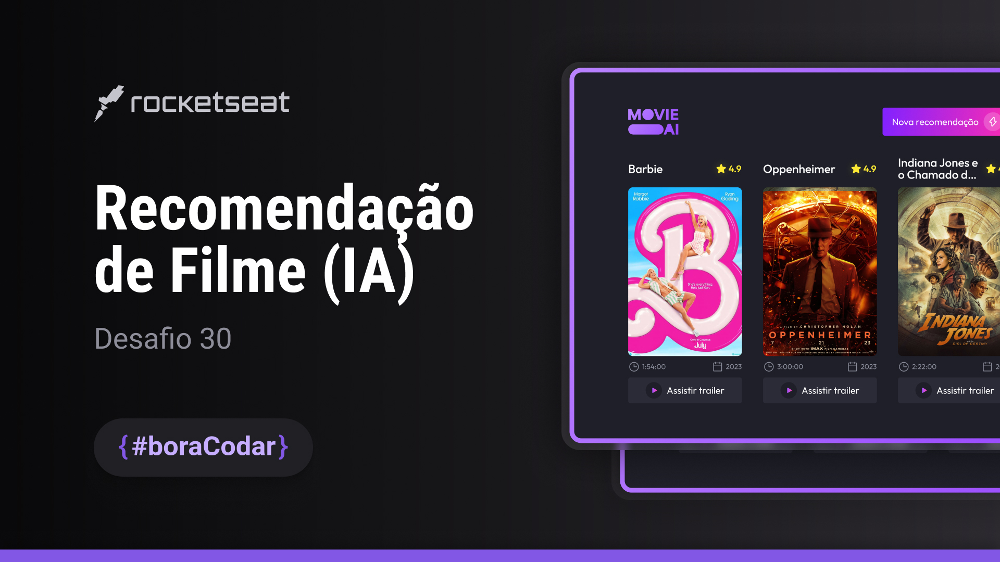

<h1 align="center">#BORACODAR</h1>

O #boracodar é uma realização feita pela a rocketseat, onde toda semana será enviado um desafio no site do <a href="https://www.rocketseat.com.br/boracodar">boracodar.</a> E no projeto da semana 30 foi disponibilizado esse layout para recomendação de filmes.

 

  <a href="#-tecnologias">Tecnologias</a>&nbsp;&nbsp;&nbsp;|&nbsp;&nbsp;&nbsp;
  <a href="#-projeto">Projeto</a>&nbsp;&nbsp;&nbsp;|&nbsp;&nbsp;&nbsp;
  <a href="#-layout">Layout</a>&nbsp;&nbsp;&nbsp;|&nbsp;&nbsp;&nbsp;
  <a href="#memo-licença">Licença</a>

  

 

  

## 🚀 Tecnologias

Esse projeto foi desenvolvido com as seguintes tecnologias:

- HTML
- SCSS
- JavaScript
- [API TMDB](https://www.themoviedb.org/?language=pt-BR)
- Figma

## 💻 Projeto

- [Visite o projeto online](https://kelvinymickael.github.io/ROCKETSEAT_MOVIE_RECOMMENDATION/)

## 🔖 Layout

Você pode visualizar o layout do projeto através [DESSE LINK](https://www.figma.com/file/A7PuSz1kEdCQbUv5wrJ2Dv/Recomenda%C3%A7%C3%A3o-de-Filme-com-IA-%E2%80%A2-Desafio-30-(Community)?type=design&node-id=314-315&mode=design&t=izpEWbf8Z8VgH39e-0). É necessário ter conta no [Figma](https://figma.com) para acessá-lo.

## :memo: Licença

Esse projeto está sob a licença MIT.

---

Developed By Kelviny Mickael.
